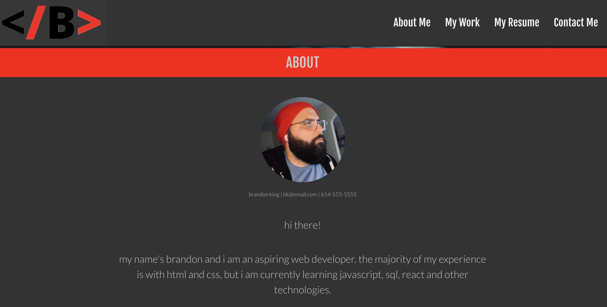
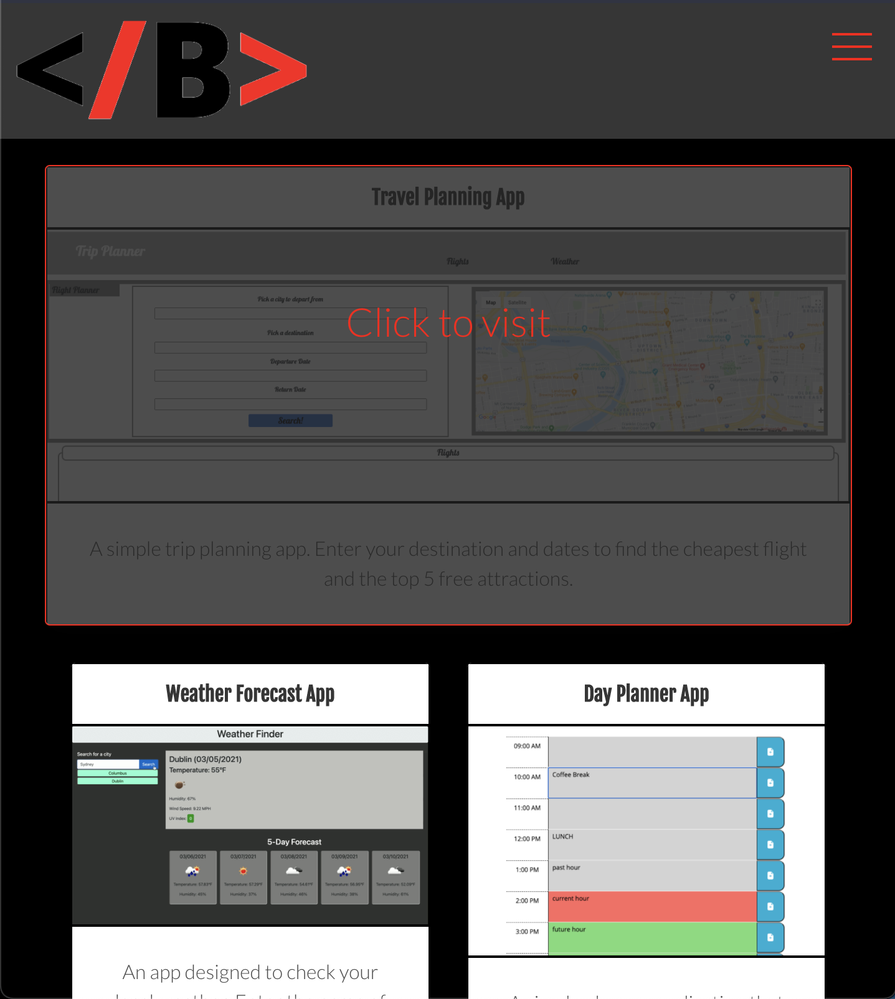

# Brandon King's Professional Portfolio

## Description
This repository houses my professional portfolio.

It is a constant work in progress! So do not be suprised if it looks different on your next visit. 

## Technologies Used
`HTML, CSS, JavaScript, Bulma CSS Framework, JQuery`

## Links

### [Deployed Application](https://thebsking.github.io/portfolio)
### [Repository](https://github.com/thebsking/portfolio)

## Preview

## License

## Contact
brandonscottking@gmail.com